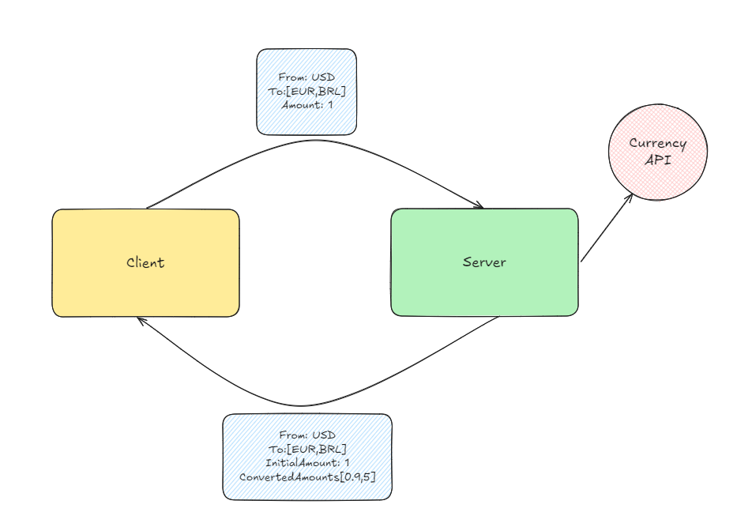

<h1 align="center">Conversor de Moedas</h1>

### :books: Descrição

<p>Projeto da disciplina DM113 - Desenvolvimento de serviço SOAP com WCF em C# </p>
<p>Trata-se de um projeto simples de gRPC unário, cujo principal objetivo é a conversão de moedas, a topologia é um cliente-servidor simples, onde será enviado pelo cliente as informações, e pelo servidor será realizado as tratativas necessárias e devolvida os valores já convertidos.</p>

#### Projeto
<p>A estrutura básica de funcionamento de projeto pode ser vista na imagem abaixo: </p> 

<p align="center">

</p>

<p>Como pode ser visto, o funcionamento é bem simples. De forma que o cliente faz uma requisição, o servidor consulta a CurrencyAPI para obter os rates mais atualizados e responde a requisição.</p>
<p>A requisição possui o seguinte envelope: </p>

```
from: Trata-se da moeda original, ou seja, a moeda de base que você deseja saber os valores convertidos.
to: Trata-se da(s) moeda(s) de destino, ou seja, para qual(is) moeda(s) você deseja saber a conversão.
amount: Valor que você deseja saber a conversão dada a moeda de origem.
```

<p>A resposta possui o seguinte envelope: </p>

```
from: Trata-se da moeda original, ou seja, a moeda informada pelo cliente para realização de conversão.
to: Trata-se da(s) moeda(s) de destino, ou seja, para qual(is) moeda(s) o cliente deseja saber a conversão.
initial_amount: Valor inicial informado pelo cliente.
converted_amount: Valor(es) convertido(s).
```

<p>Dado esse funcionamento informado, o cliente enviará uma requisição dada uma moeda de base, e poderá também enviar uma ou mais moedas de destino, junto ao valor, ao final da execução, será retornada as informações iniciais da requisição, juntamente aos valores convertidos.</p>

### :computer: Funcionalidade do Projeto
#### Funcionalidades

### :hammer_and_wrench: Ferramentas utilizadas
<p>As seguintes ferramentas foram utilizadas no desenvolvimento da solução</p>

- [Visual Studio](https://git-scm.com/)
- [Currency API](https://currencyapi.com/)
- [gRPC](https://grpc.io/)

#### Preparação do ambiente no computador para executar a API
<p>Para a execução do projeto, é necessário que você possua uma API Key, que permitirá a consulta do server a API externa(Currency API).
Encontra mais informações como gera-la, na documentação oficial (https://currencyapi.com/docs). De forma bem resumida, será necessário apenas fazer o login ou cadastro na plataforma deles, possuem um plano gratuito que te dará 300 requisições gratuitas. No dashboard da plataforma você verá alguma coisa parecida com isso cur_live_XXXXXXXXXXXXXXXXXXXXXXXXXXXXXXXX é essa que é sua API KEY.</p>
<p>Já com a API KEY em mãos, acesse o arquivo CurrencyConverterImpl.cs e substitua o valor da apiKey para o que você agora possui.</p>
📁client
📂server
    📁enums
    📁models
    📂services
        📄CurrencyConverterImpl.cs

<p>Após a substituição, abra o terminal e rode o comando para buildar o projeto</p>
```
$ dotnet build
```

<p>No arquivo Program.cs do client, faça as substituições como quiser, e faça as conversões conforme julgue pertinente.</p>
📂client
    📄CurrencyConverterImpl.cs
📁server

<p>Em seguida execute os projetos em modo de depuração.Inicialmente rode o server e depois o client. Ao final dessa operação, você já deve passar a visualizar os valores sendo disponibilizados em sua tela.</p>

## :gear: Autor

* **Gabriel Ilian Fonseca Barboza** - [Gabriel](https://github.com/G-ilian) 
